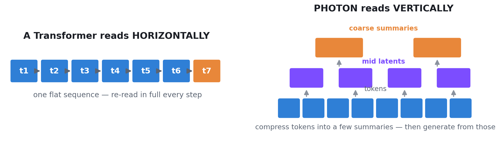
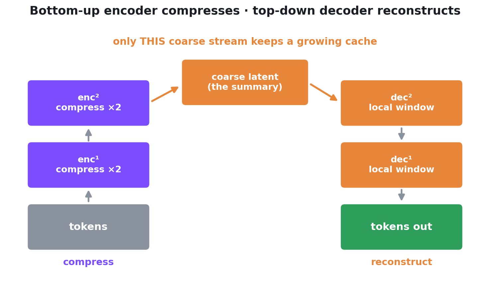
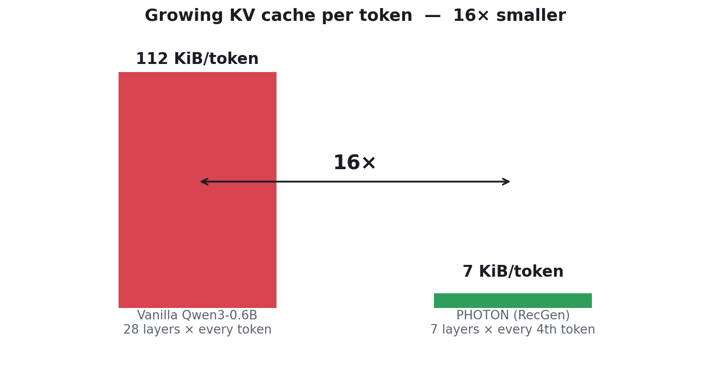

# OpenPHOTON

OpenPHOTON converts a pretrained **Qwen3-0.6B** into a **PHOTON** hierarchy
by staged distillation, rather than pretraining PHOTON from scratch. It is
an independent, from-scratch implementation and study of the PHOTON
architecture, released as a proof of concept with honestly-reported
results (not a finished, shippable model -- see "What this is / isn't"
below).

## What is PHOTON?



*A Transformer re-reads one flat, ever-growing sequence. PHOTON reads **vertically** — compressing tokens into a handful of coarse summaries and generating from those.*

PHOTON is a hierarchical transformer architecture built to keep only a
small, slowly-growing key-value (KV) cache at decode time instead of one
entry per layer per token. It splits the stack into four stages --
`enc1 -> enc2 -> dec2 -> dec1` -- with chunkers that fold tokens into
coarser latents on the way up, and converters that "brief" local decoders
on the way back down. At generation time (**RecGen**), only the coarsest
stream (`enc2`) keeps a growing KV cache; the local decoders operate over
small, bounded windows. At this repo's (C1=2, C2=2) setting, that's a
**~16x** smaller growing KV cache than a vanilla transformer of the same
depth (measured: 57,344 -> 3,584 entries at 2048 tokens -- see Results).



*The hourglass: a bottom-up encoder compresses tokens into coarse latents, and a top-down decoder reconstructs them locally — only the coarse stream at the top keeps a growing KV cache.*

Rather than training a PHOTON model from random init, this repo starts
from a pretrained Qwen3-0.6B, slices its 28 transformer layers 7/7/7/7
across the four stages (verbatim, no re-mapped weights), attaches four new
modules (two chunkers, two converters), and distills the compressed
hierarchy to reproduce the original model's behavior in stages:

- **S0** -- surgery + a golden-test harness (bit-exact vs. the stock model
  in bypass mode, where the compression is turned off).
- **S1** -- per-block hidden-state matching (each new stage learns to
  reproduce its corresponding stretch of the stock model's hidden states,
  teacher-forced and decoupled from the other stages).
- **S2** -- composed forward + reconstruction loss (the stages are chained
  together for real, and a reconstruction term keeps the compressed
  representation consistent with itself for RecGen at inference time).
- **S3** -- logit / KL distillation (the objective switches to matching
  the teacher's output *distribution* directly, which is what actually
  closes most of the quality gap -- see Results).

## Results

Measured on this Qwen3-0.6B conversion, at the (C1=2, C2=2, R1=2, R2=2)
architecture used throughout this repo:

- **Composed teacher-gap** (student perplexity / teacher perplexity on a
  held-out probe, chained forward, no teacher forcing):
  **33.3x (S1) -> 20.5x (S2) -> ~7x (S3, 0.5B-token trial)**.
- **Reconstruction cosine**: 0.99 between the decoder's reconstructed
  level-1 latent and the true one (the quantity RecGen's exactness
  guarantee depends on).
- **RecGen plumbing** (the windowed, recursive decode path used for
  generation) verified against the model's own non-recursive forward pass
  to **2.9e-5** max abs diff (5/5 verification tests passing).
- **KV footprint**: 57,344 -> 3,584 growing-KV entries at 2048 tokens
  (**16x**), matching the analytic (C1*C2) reduction exactly.
- **Honest negative result**: an `rec_weight` sweep in S3 (the weight on
  the reconstruction anchor term, `rec_B`) tuned that term's contribution
  but left RecGen's actual generation fidelity flat at ~18% -- fidelity
  turned out to depend on a *different* term (`rec_A`, S2's own
  reconstruction loss) that the sweep didn't touch. Recorded here rather
  than smoothed over, since it's the most concrete lead on what to try
  next.



*Growing KV cache per token: the vanilla model caches every layer for every token; PHOTON (RecGen) caches only the coarse stream — ~16x smaller at this repo's (2,2) setting.*

## What this is / isn't

This is a genuine proof of concept that a pretrained dense transformer
**can** be converted into PHOTON's compressed hierarchy by staged
distillation, with a real, measured, closing teacher-gap at each stage.

It is **not** a finished or shippable model. At ~7x the teacher's
perplexity, the S3 checkpoint is fluent locally but wanders over longer
generations -- coherent phrasing, unreliable long-range consistency. The
most likely path to a genuinely usable checkpoint is more distillation
tokens at S3, plus following up on the `rec_A` lever the negative result
above points at.

## Repo layout

```
photon/      architecture: config, model, modules (chunker/converter), rope, masks, reshape, surgery
train/       loss functions + training steps for S1/S2/S3
inference/   RecGen generation + KV-footprint accounting
tests/       unit + integration tests (shapes, golden/bit-exactness, per-stage losses, RecGen)
configs/     per-stage hyperparameter configs (S1Config/S2Config/S3Config + Smoke* variants)
harness/     teacher hidden-state capture (offline .npz dump + online selective-hook capture)
checkpoint/  atomic save/load (model + optimizer + dataloader state)
data/        shard format, tokenization, streaming dataset
scripts/     CLI launchers, smoke tests, evals, pod setup
```

## Quickstart

```bash
pip install -e .
```

```python
from openphoton import load_openphoton, generate, kv_footprint

model = load_openphoton("OpenPHOTON/Qwen3-0.6B")   # HF repo id OR local checkpoint path
print(generate(model, "In a small village by the sea,", max_new_tokens=40, temperature=0.7))
print(kv_footprint(model, seq_len=2048))            # -> (57344, 3584, 16.0)
```

**Note:** the `OpenPHOTON/Qwen3-0.6B` Hugging Face checkpoint is a
**pending upload**. Until it's live, `load_openphoton` also accepts a
local checkpoint path (e.g. `load_openphoton("checkpoints/s3_final_ckpt.pt")`)
produced by the training scripts below.

## Training

Each stage has a standalone CLI launcher with a local `smoke` mode (tiny,
fast, no real data) and a `production` mode (real token budget, requires a
real dataset and a GPU):

```bash
python scripts/run_s1.py --mode smoke
python scripts/run_s2.py --mode smoke
python scripts/run_s3.py --mode smoke
```

See each script's `--help` and `configs/s1.py` / `configs/s2.py` /
`configs/s3.py` for the production hyperparameters and data requirements.

## Credits

- PHOTON: Ichikawa et al., ["PHOTON"](https://arxiv.org/abs/2512.20687),
  arXiv:2512.20687.
- Staged distillation methodology follows MOHAWK: Bick et al.,
  ["MOHAWK"](https://arxiv.org/abs/2408.10189), arXiv:2408.10189.

This is an independent reproduction and study, not affiliated with either
paper's authors. All numbers reported above are measured on this
particular Qwen3-0.6B conversion.

## License

MIT -- see [LICENSE](LICENSE).
